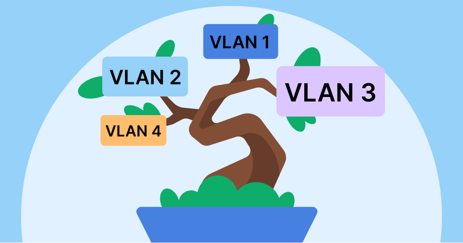

# VLAN Implementation for Broadband Cost Reduction
Consolidated three broadband connections and implemented VLANs to optimize network resources, reduce costs, and improve overall network efficiency.

## Situation

## Environments and Technologies Used

- Item 1
- Item 2
- Item 3

## Operating Systems Used

- Operating System Name

## High-Level Deployment and Configuration Steps

- Step 1
- Step 2
- Step 3
- Step 4
- Step 5

<h2>Architecture Diagram</h2>

