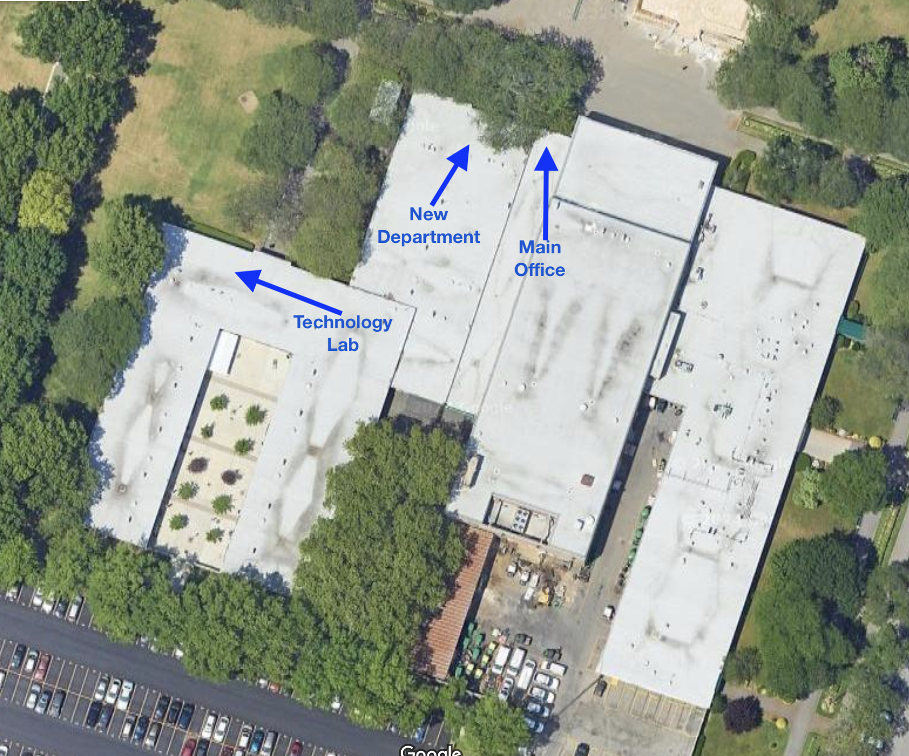

# VLAN Implementation for Broadband Cost Reduction
When this non-profit organization first established, there was only one office.  As the organization grew, it added a technology lab and another department.  In order to meet the demands of the two departments and the users of the technogy lab, broadband accounts were set up at all three locations.    

The broadband connections were consolidated and VLANs were implemented to optimize network resources, reduce costs, and improve overall network efficiency.

## Environments and Technologies Used

- Netgear M4100-24G-POE+ Managed Switches 
- Netgear SFP GBIC modules
- Fiber patch panel and patch cables
- 400ft of multimode OM3 fiber optic cable
- FortiGate-60E Firewall

## Operating Systems Used
Windows 10

## High-Level Deployment and Configuration Steps

- Perform network assessment and VLAN design 
- Install all switches, patch panels, and cables at new locations
- Run ethernet and fiber lines to new locations and confirm connectivity
- Configure VLANs on the main office switch to segment the network
- Configure VLANs on switches in the new locations
- Configuure VLANs and firewall rules on Fortigate
- Check configurations by connecting to workstations at each site to ensure connectivity

<h2>Architecture Diagram</h2>

